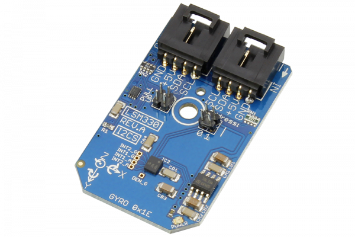

[](https://store.ncd.io/product/lsm330-inemo-inertial-module-3d-accelerometer-3d-gyroscope-i2c-mini-module/).

# LSM330

Manufactured by STMicroelectronics, the LSM330 is a system-in-package which features a 3D digital accelerometer with two embedded state machines which can be programmed to implement autonomous applications and a 3D digital gyroscope.
This Device is available from www.ncd.io

[SKU: LSM330]

(https://store.ncd.io/product/lsm330-inemo-inertial-module-3d-accelerometer-3d-gyroscope-i2c-mini-module/)
This Sample code can be used with Raspberry Pi.

Hardware needed to interface LSM330 3D accelometer,3D gyroscope sensor With Raspberry Pi :

1. <a href="https://store.ncd.io/product/lsm330-inemo-inertial-module-3d-accelerometer-3d-gyroscope-i2c-mini-module/">LSM330 3D accelometer,3D gyroscope sensor</a>

2. <a href="https://store.ncd.io/product/i2c-shield-for-raspberry-pi-3-pi2-with-outward-facing-i2c-port-terminates-over-hdmi-port/">Raspberry Pi I2C Shield</a>

3. <a href="https://store.ncd.io/product/i%C2%B2c-cable/">I2C Cable</a>

## Python

Download and install smbus library on Raspberry pi. Steps to install smbus are provided at:

https://pypi.python.org/pypi/smbus-cffi/0.5.1

Download (or git pull) the code in pi. Run the program.

```cpp
$> python LSM330.py
```
The lib is a sample library, you will need to calibrate the sensor according to your application requirement.
